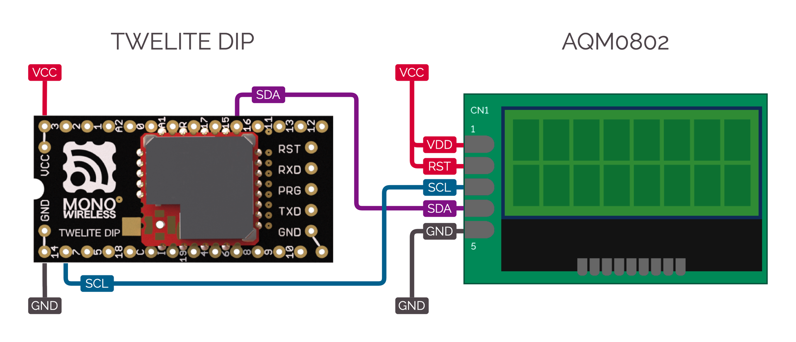

# ActEx_AQM0802

## はじめに / About

Sitronix社のI2C接続LCDコントローラ ST7032 を実装したLCDモジュール AQM0802 を使用するサンプルです。

Act sample using AQM0802 LCD modules built with the Sitronix ST7032 I2C controller.

## 接続方法 / Connection



AQM0802の電源およびリセットピンを接続したうえで、I2C SCLとI2C SDAをTWELITEに接続します。

Connect powerlines and the reset pin on the AQM0802, then connect I2C SCL and I2C SDA to the TWELITE.

## 動作環境 / Environment

以下の環境でActの動作を確認しました。

- ソフトウェア
  - [MWSDK](https://mono-wireless.com/jp/products/stage/index.html) 2022年7月版 (macOS Monterey)
- ハードウェア
  - 自社製品
    - [TWELITE DIP BLUE (TWE-L-DI-W)](https://mono-wireless.com/jp/products/TWE-Lite-DIP/index.html)
    - [TWELITE R2 (MW-LITER2)](https://mono-wireless.com/jp/products/TWE-LITE-R/index.html)
  - 他社製品
    - [Ｉ２Ｃ接続小型ＬＣＤモジュール (AE-AQM0802)](https://akizukidenshi.com/catalog/g/gM-09109/)

This Act has been tested in the following environment:

- Software
  - [MWSDK](https://mono-wireless.com/jp/products/stage/index.html) 2022 July (macOS Monterey)
- Hardware
  - Own products
    - [TWELITE DIP BLUE (TWE-L-DI-W)](https://mono-wireless.com/jp/products/TWE-Lite-DIP/index.html)
    - [TWELITE R2 (MW-LITER2)](https://mono-wireless.com/jp/products/TWE-LITE-R/index.html)
  - Third-party products
    - [Ｉ２Ｃ接続小型ＬＣＤモジュール (AE-AQM0802)](https://akizukidenshi.com/catalog/g/gM-09109/)

## サンプルアクト / Act sample

`ActEx_AQM0802`は、このActに同梱しているMWX向けライブラリ `AQM0802` を使用したサンプルです。

はじめに`setup()`内でスタートメッセージを表示した後、`Timer0`を初期化します。
`loop()`では、`Timer0`を使って1秒おきにカウント値を加算し、経過秒数を表示します。
なお、このとき`AQM0802::printf()`は自動的に改行処理を行います。

`ActEx_AQM0802` is an Act sample using the included library `AQM0802`.

In the `setup()`, show initial messages and initialize the `Timer0`.
In the `loop()`, periodically increment the count value with `Timer0` and show elapsed time seconds.
`AQM0802::printf()` can process newlines automatically.

## ライブラリ / Library

### 初期化 / Initialization

```C++:ActEx_AQM0802.cpp
    // Setup the display
    display.begin();
```

`AQM0802`クラスのインスタンスをグローバル空間に宣言し、`setup()`内で`AQM0802::begin()`を呼びます。

Create a global instance of the `AQM0802` class, then call `AQM0802::begin()` in the `setup()`.

### 消去 / Clearing

```C++
    // Clear the display
    display.clear();
```

ディスプレイの内容を消去するには、`AQM0802::clear()`を呼びます。

Use `AQM0802::clear()` to clear contents on the display.

### 文字列の表示 / Print strings

```C++:ActEx_AQM0802.cpp
        // Increment the count number and print it
        display.printf("%05d[s]\n", ++count);
```

書式文字列を表示するには、`AQM0802::printf()`を呼びます。
C言語標準ライブラリの`printf()`と同様に使えますが、一度に表示できる最大の文字数が`AQM0802_PRINTF_MAX`に定義されており、デフォルトは64文字です。

Use `AQM0802::printf()` to print formatted strings.
You can use this method like the `printf()` in the C standard library, but maximum count of the string is limited to the `AQM0802_PRINTF_MAX`. Default value is 64.

```C++:AQM0802/AQM0802.hpp
/// Maximum length of printf() strings
#define AQM0802_PRINTF_MAX 64
```

### 文字の表示 / Put a character

```C++
    // Print 'a'
    display.putc('a');
```

文字を表示するには、`AQM0802::putc()`を呼びます。
C言語標準ライブラリの`putc()`あるいは`putchar()`と同様に使えます。

Use `AQM0802::putc()` to put a character.
You can use this method like the `putc()` or `putchar()` in the C standard library.

### カーソルの移動 / Move the cursor

```C++
    // Move the cursor to the y:1,x:3
    display.move(1, 3);
```

`AQM0802::printf()` または `AQM0802::putc()`の表示開始位置を変更するには、`AQM0802::move()`を呼びます。
ncursesライブラリの`move()`と同様に使えます。

Use `AQM0802::move()` to move the cursor position for `AQM0802::printf()` or `AQM0802::putc()`.
You can use this method like the `move()` in the ncurses library.

## ライセンス / License
MW-OSSLA-1 (MONO WIRELESS OPEN SOURCE SOFTWARE LICENSE AGREEMENT)
